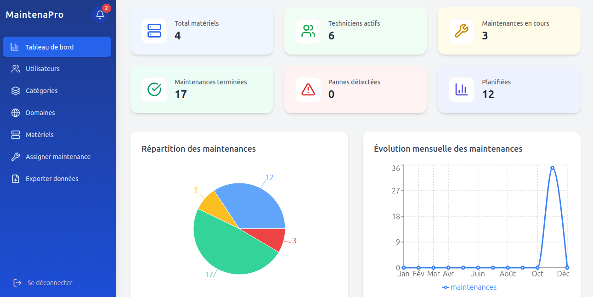

# MaintenaPro 🛠️
**La plateforme ultime pour la gestion des maintenances, techniciens et équipements**
## 🌟 Description
MaintenaPro est une plateforme web moderne qui centralise la gestion des matériels et techniciens, 
permettant de planifier, suivre et optimiser toutes les maintenances en temps réel. 
Notifications instantanées, priorisation intelligente des tâches et génération automatique de rapports : 
tout est pensé pour améliorer l’efficacité opérationnelle de votre équipe technique.
## ⚙️ Fonctionnalités principales

- Gestion complète des utilisateurs (Admin et Technicien)
- Gestion des matériels et équipements avec statut en temps réel
- Planification et suivi des maintenances
- Exporter en pdf/csv les données
- Priorisation des tâches : Basse, Moyenne, Haute, Urgente
- Notifications en temps réel pour les techniciens et admins
- Rapports automatiques après chaque maintenance
- Recherche avancée et filtres par statut, technicien, matériel, tâche
- Interface moderne, responsive et intuitive avec React + TailwindCSS
- Backend robuste avec Node.js, Express, Prisma et PostgreSQL
  
  ## 🖥️ Captures d’écran
### Tableau de bord principal


## 🖥️ Technologies utilisées

**Frontend**
- React 18 + TypeScript  
- TailwindCSS pour un design moderne et responsive  
- Axios pour les requêtes API   

**Backend**
- Node.js + Express  
- Prisma ORM avec PostgreSQL  
- Bcrypt & JWT pour une sécurité optimale
- Socket.io — notifications en temps réel

## 🚀 Installation rapide

### 1️⃣ Cloner le projet
```bash
git clone https://github.com/NomenaIantsamitia/MaintenaPro.git
cd chat

2️⃣ Installer et lancer le frontend
cd front
npm install
npm run dev

3️⃣ Installer et lancer le backend
cd ../backend-taches
npm install
npx prisma migrate dev
npm run dev

4️⃣ Ouvrir l’application
http://localhost:5173

Interface moderne et responsive adaptée à toutes tailles d’écran

Notifications et rapports automatisés

Code propre et structuré : prêt pour la production

Projet pensé pour les entreprises réelles

## 📬 Contact

**MIT License © 2025 Nomena Misedratiana**

💌 **Email :** [nomena.misedratiana05@gmail.com](mailto:nomena.misedratiana05@gmail.com)  
💼 **Portfolio :** [https://nomena-portfolio.vercel.app](https://nomena-portfolio.vercel.app)  


